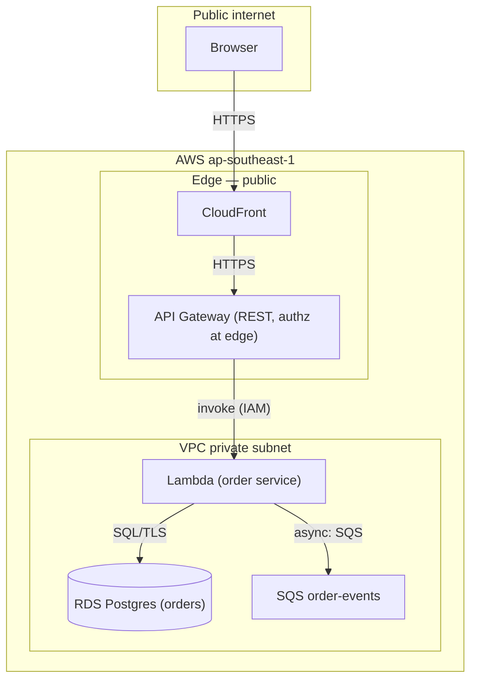

# claude-agent-team

**A full-SDLC agent team for Claude Code — clone the repo, run `/build-product`.
Eleven roles, nine phases, no install.**

Claude Code reads `.claude/` from the project root automatically, so a clone needs no install
step — or copy it into `~/.claude/` to get the team in every project.

## Install

Two ways, depending on whether you want the team in **one project** or in **every project
on your machine**.

### One project — clone it (recommended)

The team travels with the repo. Nothing is installed, nothing is shared.

```bash
git clone https://github.com/TechX-Corp/claude-agent-team.git my-product && cd my-product
rm -rf .git && git init          # start your own history
claude
```

Nothing to enable. Claude Code loads `.claude/agents/`, `.claude/commands/`, and
`.claude/skills/` from the project root on startup — there is no `settings.json` in this
repo and none is needed.

Use this when the team is *for this product*. Edits to an agent stay with the repo, get
committed, and reach whoever clones it next.

### Every project — copy into `~/.claude/`

Makes the eleven agents and both commands available in any directory you run `claude` from.

```bash
git clone https://github.com/TechX-Corp/claude-agent-team.git /tmp/agent-team

mkdir -p ~/.claude/agents ~/.claude/commands ~/.claude/skills
cp -r /tmp/agent-team/.claude/agents/*   ~/.claude/agents/
cp -r /tmp/agent-team/.claude/commands/* ~/.claude/commands/
cp -r /tmp/agent-team/.claude/skills/*   ~/.claude/skills/
```

Restart Claude Code. `CLAUDE.md` is **not** copied — it holds this repo's rules, and a
global copy would apply them to every unrelated project you open.

Three things to know before choosing this:

- **A project copy takes precedence over the global one.** Same agent name in both places →
  `.claude/` in the project wins. That is the fix when a global agent is wrong for one repo:
  drop a corrected copy in that project.
- **The copies then drift.** Nothing syncs them. Pull this repo six months later and your
  `~/.claude/` still has the old files — re-run the `cp` to update.
- **Check what you are overwriting.** If you already have `~/.claude/commands/build-product.md`
  or a `claude-design-handoff` skill from somewhere else, the `cp` replaces it silently.
  `diff -r` first if you are unsure.

Prefer the per-project clone unless you genuinely want these roles everywhere.

### Check it landed

```
/agents      # eleven roles listed
/help        # /build-product and /adopt-codebase listed
```

Missing? You opened Claude Code outside the repo root, the session predates the install, or
`.claude/` is gitignored. `cd` to the right place and restart.

### Example — a new product from nothing

```
/build-product "a mood tracker for small teams"
```

What you will see:

```
Phase 1  product-strategist
         → asks: who feels this pain today, and what do they do instead?
         → writes docs/validated-idea.md
         ⏸  approve / edit / redo

Phase 2  spec-writer + ux-designer          (running in parallel)
         → docs/requirements.md, user-stories.md, ux-wireframes.md
         ⏸  approve / edit / redo

Phase 3  technical-architect
         → docs/architecture.md, implementation-plan.md
         → src/contract.ts + tests/contract.test.ts   ← frozen here
         ⏸  approve / edit / redo          (last checkpoint)

Phase 4-8 run without stopping:
         scaffolding → parallel worktrees → tests → review + security → PR
         ⏹  stops at the PR. You merge.
```

Answering `edit` at a checkpoint sends your notes back to that agent and re-runs it.
`redo` starts the phase over.

### Example — an existing codebase

`/build-product` assumes an empty folder. For a repo that already has code but no
`docs/`, start here instead:

```
/adopt-codebase "add SSO login"
```

It maps the real entry points, directories, and data stores; verifies the install/run/test
commands by actually running them; writes `docs/codebase-map.md` and an **as-built**
`docs/architecture.md`; backfills only the artefacts your stated goal needs — then tells
you which `/build-product` phase to resume at. Most existing projects land at Phase 5.

```
/adopt-codebase          # no goal — just map and organise, then stop
```

It never starts implementing. It reports and hands the decision back.

## What runs

Nine phases. Phases 1-3 stop for your approval; 4-9 run through to a pull request.

| Phase | Agent | Artefact |
|---|---|---|
| 1 Discovery | `product-strategist` | `docs/validated-idea.md` |
| 2 Specs + UX *(parallel)* | `spec-writer`, `ux-designer` | `requirements.md`, `user-stories.md`, `ux-wireframes.md` |
| 3 Architecture | `technical-architect` | `architecture.md`, `implementation-plan.md`, **contract file + test** |
| 4 Scaffolding | `devops-engineer` | repo, CI, green empty suite |
| 5 Implementation *(parallel worktrees)* | `backend-developer`, `frontend-developer` | feature branches |
| 6 Tests | `test-engineer` | test suite |
| 7 Review + security *(parallel)* | `code-reviewer`, `security-auditor` | `review-report.md`, `security-audit.md` |
| 8 Ship | `devops-engineer` | pull request |
| 9 Feedback | `feedback-triage` | `docs/backlog.md` |

## The two ideas that make it work

**Artefacts are the handoff.** Each phase writes a file; the next phase reads it.
Nothing depends on what was said in chat, so the pipeline survives `/clear`, a crash,
or someone else picking it up next week.

**The contract is frozen at Phase 3.** The architect ships the interface as a real code
file with a test pinning it. Phase 5 implementers may read it but never edit it — which
is what lets backend and frontend run in parallel git worktrees without colliding.

## What Phase 3 draws

`docs/architecture.md` opens with a diagram, not a paragraph. Mermaid in the markdown —
diffable in review, editable by a later phase, and rendered by GitHub as-is:



Drawn the way AWS reference architectures are: **grouped by boundary** (region → VPC →
subnet) rather than by layer, **every node a named service plus its role** — `API Gateway
(REST, authz at edge)`, never `Backend` — and **every arrow carrying its protocol**. An
unlabelled arrow is a question, not a decision.

That is also why Phase 7 works. `security-auditor` starts at this diagram: the trust
boundaries tell it which crossings to audit first, and a boundary drawn here but missing
in the code is itself a finding.

## Designs from claude.ai/design

`ux-designer` handles Claude Design handoffs through `.claude/skills/claude-design-handoff/`,
which **travels with this repo** — no install, works on any clone. Drop a
`claude.ai/design/p/<uuid>` link, a share link, or an exported `IDE - <name>.html` and it
covers fetching both link types, the DC-runtime → vanilla port, the 256 KiB silent-truncation
trap on assets, and the render gate.

## AWS projects

Seven agents carry an **AWS** section pointing at the official `aws-core` / `aws-agents`
plugin skills. Those plugins live in your Claude Code install, not in this repo — if they
are not installed the sections are simply ignored, and everything else still works.

| Agent | AWS skills it reaches for |
|---|---|
| `product-strategist` | `aws-billing-and-cost-management`, `agents-pay` — is the unit cost survivable |
| `technical-architect` | `aws-blocks`, `aws-serverless`, `aws-compute`, `aws-containers`, `aws-database`, `amazon-bedrock`, `agents-build`, billing |
| `backend-developer` | `aws-sdk-python-usage` / `aws-sdk-js-v3-usage`, `aws-secrets-manager`, `aws-database`, `aws-messaging-and-streaming`, `amazon-bedrock`, `agents-connect` |
| `devops-engineer` | `signing-in-to-aws`, `aws-cdk`, `aws-cloudformation`, `aws-deployment`, `launch-with-aws`, `aws-containers`, `aws-observability`, `agents-deploy` |
| `test-engineer` | `aws-observability` |
| `security-auditor` | `aws-iam`, `aws-secrets-manager`, `agents-harden` |
| `feedback-triage` | `aws-observability`, `agents-debug`, `agents-optimize`, billing |

Install them with `/plugin` if you do not have them. Not building on AWS? Delete the
AWS section from each agent — nothing else depends on it.

## Commands

| Command | For |
|---|---|
| `/build-product "<idea>"` | A new product. Runs all 9 phases. |
| `/adopt-codebase ["<next goal>"]` | An existing repo with code but no `docs/`. Maps it, backfills what the goal needs, tells you which phase to resume at. |

## Adapting it

- `CLAUDE.md` — your stack, commands, conventions. Every agent reads it.
- `.claude/agents/*.md` — edit a role's rules, or add one.
- `.claude/commands/build-product.md` — change the phase order or drop phases.

Starter prompts inside each agent come from the
[Claude Code prompt library](https://code.claude.com/docs/en/prompt-library).
